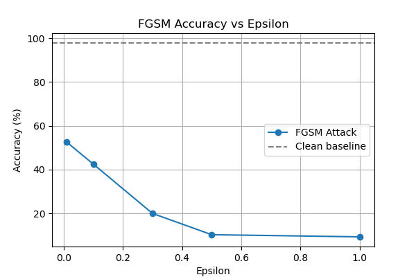

# Adversarial Attacks on MNIST (FGSM vs Gaussian Noise)

This part explores **adversarial robustness** of a CNN trained on the MNIST handwritten digit dataset. I have implemented two types of perturbations:

1. **FGSM (Fast Gradient Sign Method)** – an adversarial attack that perturbs pixels in the direction of the gradient of the loss.
2. **Gaussian Noise** – random noise added to the input image.

We then evaluate how the model’s accuracy changes as we vary the **perturbation strength (ε)**.

## Project Overview

- A simple **Convolutional Neural Network (CNN)** is used for digit classification.
- Pretrained weights are loaded from a Hugging Face-hosted model.
- Images from the MNIST test set are perturbed using FGSM or Gaussian noise.
- We measure how accuracy drops as ε increases.
- Results are visualized with graphs comparing FGSM and Gaussian perturbations.

## Model

We use a **simple CNN**:

```python
class SimpleCNN(nn.Module):
    def __init__(self):
        super().__init__()
        self.conv1 = nn.Conv2d(1, 32, kernel_size=3, stride=1, padding=1)
        self.pool  = nn.MaxPool2d(kernel_size=2, stride=2, padding=0)
        self.fc1   = nn.Linear(32 * 14 * 14, 10)

    def forward(self, x):
        x = self.pool(F.relu(self.conv1(x)))
        x = x.view(-1, 32 * 14 * 14)
        x = self.fc1(x)
        return x
```

---

## Attack Implementations

### 1. **FGSM Attack**

Perturbs images in the direction of the gradient:

```python
def fgsm(model, loss_fn, images, labels, epsilon):
    images = images.clone().detach().to(next(model.parameters()).device)
    labels = labels.clone().detach().to(next(model.parameters()).device)
    images.requires_grad = True

    outputs = model(images)
    loss = loss_fn(outputs, labels)
    model.zero_grad()
    loss.backward()

    grad_sign = images.grad.detach().sign()
    perturbed_images = images + epsilon * grad_sign
    return torch.clamp(perturbed_images, 0, 1)
```

### 2. **Gaussian Noise**

Adds random Gaussian-distributed noise:

```python
def fgsm_gaussian(images, epsilon):
    images = images.clone().detach()
    noise = torch.randn_like(images) * epsilon
    perturbed_images = images + noise
    return torch.clamp(perturbed_images, 0, 1)
```

---

## Evaluation

We evaluate model accuracy under different conditions:

- **Clean (unperturbed) images**
- **FGSM attack**
- **Gaussian noise attack**

For each case, accuracy is computed on the MNIST test set.

---

## Results

### Accuracy Results

```
Accuracy on clean images: 97.79%

Epsilon 0.01 | FGSM acc: 52.53% | Gaussian acc: 53.68%
Epsilon 0.10 | FGSM acc: 42.46% | Gaussian acc: 52.40%
Epsilon 0.30 | FGSM acc: 19.93% | Gaussian acc: 44.46%
Epsilon 0.50 | FGSM acc: 10.23% | Gaussian acc: 32.23%
Epsilon 1.00 | FGSM acc:  9.25% | Gaussian acc: 14.20%
```

### Key Observations

- Clean accuracy is **\~98%**.
- FGSM is **much stronger** than Gaussian noise – accuracy drops sharply even at small ε.
- Gaussian noise degrades performance more gradually.

---

## Visualizations

### Accuracy vs Epsilon (FGSM)



### Accuracy vs Epsilon (Gaussian)


### FGSM vs Gaussian Comparison


````markdown
## API Usage

I also built a **FastAPI-based API** that allows you to upload an image and test the model under adversarial attacks.

### Endpoints

1. **FGSM Attack**
   ```http
   POST /fgsm_attack/
   ```
````

- **Parameters:**

  - `file`: an image file (PNG/JPG of a digit)
  - `label`: original label of the digit (int)
  - `epsilon`: strength of perturbation (float, e.g., 0.1)

- **Response:**

  ```json
  {
    "Original_label": 7,
    "Predicted_label": 4,
    "Attack success": true
  }
  ```

2. **Gaussian Noise Attack**

   ```http
   POST /fgsm_gaussian/
   ```

   - **Parameters:**

     - `file`: an image file (PNG/JPG of a digit)
     - `label`: original label of the digit (int)
     - `epsilon`: strength of perturbation (float, e.g., 0.1)

   - **Response:**

     ```json
     {
       "Original_label": 7,
       "Predicted_label": 4,
       "Attack success": true
     }
     ```

---

## How to Extend

- Try different CNN architectures.
- Train the model with **adversarial training** for robustness.
- Experiment with other attacks (PGD, DeepFool, CW).
- Apply on different datasets (CIFAR-10, FashionMNIST).
- Extend the API with batch evaluation and visualizations.

---

## References

- Goodfellow et al., _Explaining and Harnessing Adversarial Examples_ (2015)
